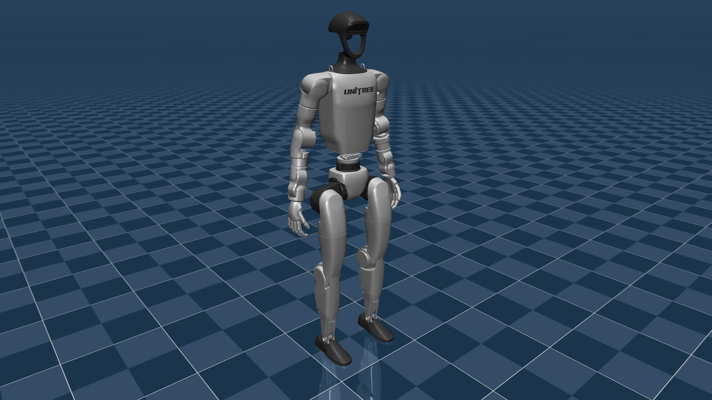
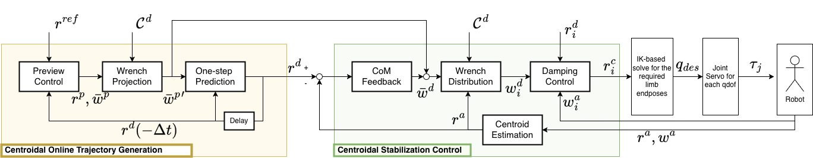
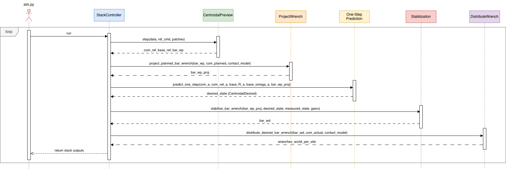
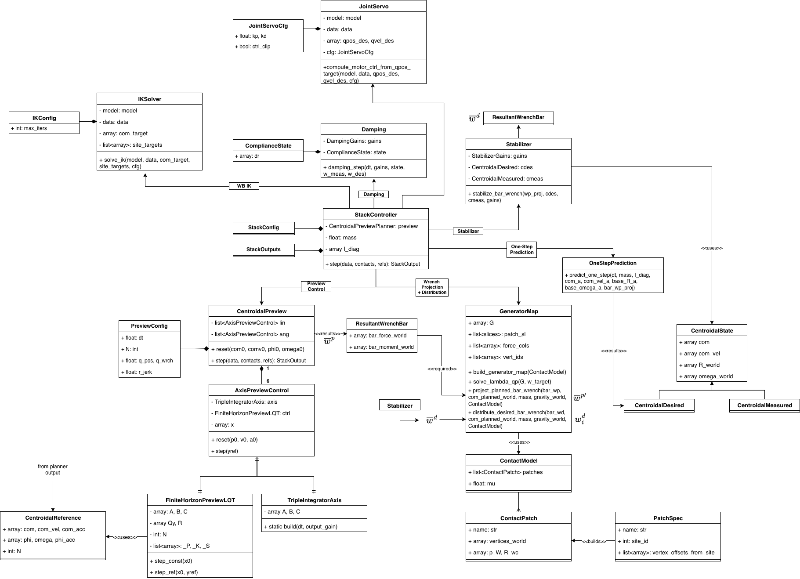

# biped-preview-control
[](https://github.com/jssilvaa/biped-preview-control/actions)

WIP of centroidal preview-control-based humanoid motion generation and stabilization.

This repository is still a WIP. It is not packaged, not polished, and not meant to look more finished than it is. 

The main goal is to reproduce in MuJoCo the control structure from the paper [1] _Centroidal Trajectory Generation and Stabilization based on Preview Control for Humanoid Multi-contact Motion_ by Masaki Murooka, Mitsuharu Morisawa, and Fumio Kanehiro.

## Figures

The figures below read from concrete to abstract.

### 1. Current MuJoCo model

This is the current Unitree G1 setup used by the main runner.



### 2. Paper-level control architecture

This figure is the best high-level summary of the project goal. It shows the two big halves of the method:

- centroidal online trajectory generation
- centroidal stabilization and execution

Reading left to right, the pipeline is: preview control, wrench projection, one-step prediction, centroidal feedback, wrench distribution, damping control, IK, then joint-level actuation. That is the main story this codebase is trying to reproduce in MuJoCo.



### 3. Stack controller runtime flow

This sequence diagram is the dynamic view of the implementation. It shows how `sim.py` calls into `StackController`, and how the controller then walks through preview, wrench projection, one-step prediction, stabilization, and final wrench distribution before returning outputs for the rest of the simulation loop.

This is useful when you want to understand execution order rather than theory.



### 4. Main classes and data flow

This is the static code-level map. It shows the key objects behind the runtime flow: preview controller, stabilizer, one-step prediction, contact model / generator map, damping state, IK, and joint servo.

If the block diagram answers "what is the control architecture?" and the sequence diagram answers "what happens each cycle?", this figure answers "which modules own that logic in the code?"



## What is here

- `src/mujoco/` contains the modular implementation.
- `src/mujoco/run_g1.py` is the main example runner for the current Unitree G1 setup.
- `src/mujoco/inspect_g1.py` prints model ids, names, and other MuJoCo bookkeeping that is useful while wiring controllers.
- `src/mujoco/verification/test_all.py` contains the current analytic test suite.
- `src/mujoco/full.py` is a flattened generated copy of the modular code. If you change code, change the modular files, not the flattened one.

Roughly speaking, the modules map onto the paper's pipeline like this:

- preview control: `preview_lqt.py`, `preview_centroidal.py`
- centroidal stabilization: `centroidal_stabilizer.py`
- wrench projection / distribution: `wrench_qp_generators.py`, `stack_controller.py`
- contact handling and measurement: `contact_measurement.py`, `contact_patches.py`, `contact_phase.py`
- compliance / damping and kinematics: `damping_control.py`, `whole_body_ik.py`, `joint_servo.py`

## Requirements

The current code expects:

- Python 3
- `numpy`
- `scipy`
- `mujoco`
- `osqp`
- `pytest`
- `matplotlib`

A standard `requirements.txt` is included.

Typical setup:

```bash
python -m venv .venv
source .venv/bin/activate
pip install -r requirements.txt
```

## Local model files

The current runner loads:

```text
models/unitree_g1/scene.xml
```

That directory is ignored in git, so you need to have the model files locally.

If you do not already have them, there is a small helper in `src/mujoco/tools/fetch_menagerie_model.py` that downloads the Unitree G1 files from MuJoCo Menagerie into `models/`:

```bash
python src/mujoco/tools/fetch_menagerie_model.py
```

## Running

Run commands from the repository root. The scripts use relative paths to the local model files.

Inspect the current G1 model:

```bash
python src/mujoco/inspect_g1.py
```

Run the main simulation and save plots:

```bash
python src/mujoco/run_g1.py
```

The runner currently:

- loads the G1 scene from `models/unitree_g1/scene.xml`
- initializes from the standing keyframe
- runs the preview-control / wrench / stabilization stack
- writes plots to `plots_g1/`
- prints a short run summary to stdout

## Tests

There is one main verification file at `src/mujoco/verification/test_all.py`.

From the repo root:

```bash
pytest src/mujoco/verification/test_all.py -v
```

## Notes

- This is currently a research/dev replication codebase, not a reusable library.
- Paths are still fairly local and opinionated.
- Some generated outputs and helper files are intentionally kept out of version control.
- If something fails on a fresh clone, the first thing to check is usually whether the local `models/` directory exists.

## Reference

This repository is based on the ideas and controller structure presented in:

[1] Masaki Murooka, Mitsuharu Morisawa, and Fumio Kanehiro, _Centroidal Trajectory Generation and Stabilization based on Preview Control for Humanoid Multi-contact Motion_, arXiv:2505.23499.

Paper links:

- HTML: https://arxiv.org/html/2505.23499v1
- PDF: https://arxiv.org/pdf/2505.23499v1
